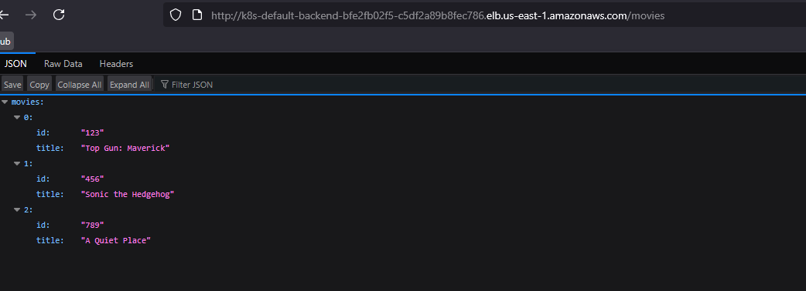
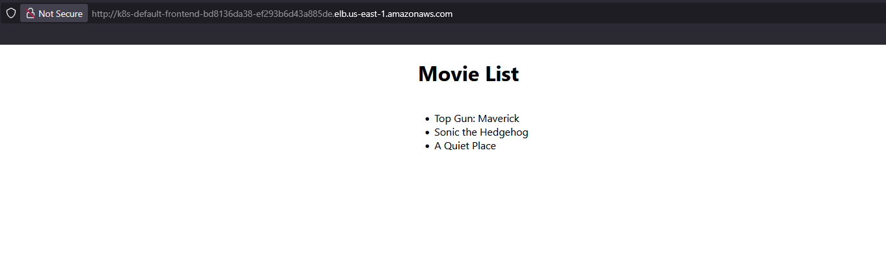
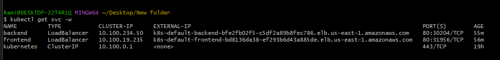
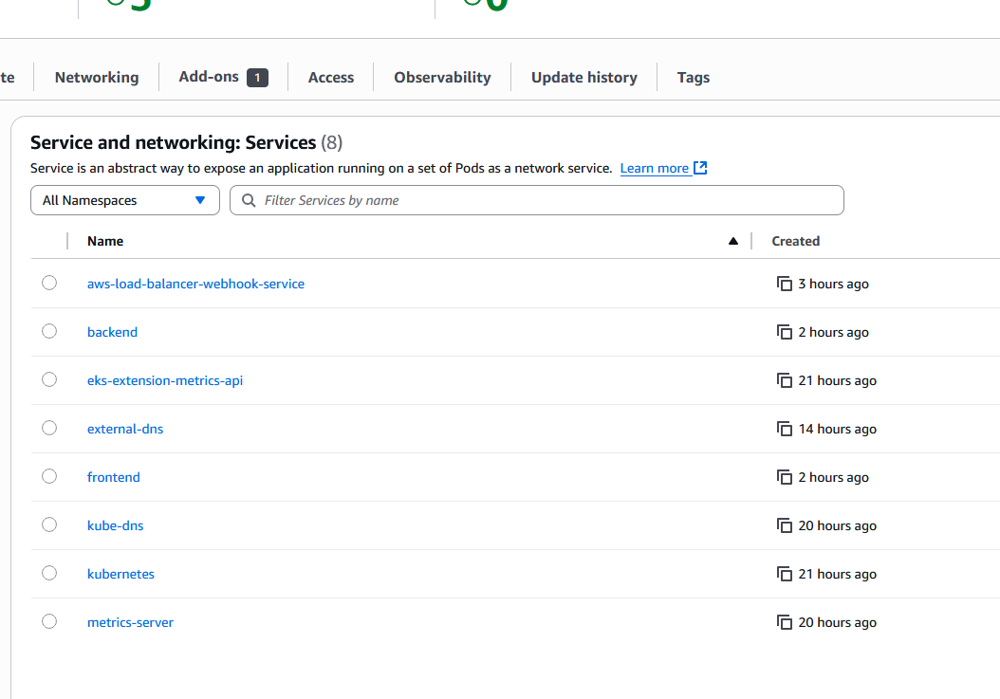

# Movie Picture Pipeline

**Live Demo:**  
- **Frontend:** [http://k8s-default-frontend-bd8136da38-ef293b6d43a885de.elb.us-east-1.amazonaws.com/](http://k8s-default-frontend-bd8136da38-ef293b6d43a885de.elb.us-east-1.amazonaws.com/)  
- **Backend API:** [http://k8s-default-backend-bfe2fb02f5-c5df2a89b8fec786.elb.us-east-1.amazonaws.com/movies](http://k8s-default-backend-bfe2fb02f5-c5df2a89b8fec786.elb.us-east-1.amazonaws.com/movies)

---

## Introduction  

This project implements a **CI/CD pipeline** for a Movie Picture web application.  
As the DevOps engineer, the goal was to automate testing, building, and deployment of the applications into an existing **Amazon EKS cluster**, leveraging **GitHub Actions** for automation.

The application consists of two parts:  
- **Frontend**: Built with **React (TypeScript)**  
- **Backend**: REST API built with **Flask (Python)**  

The pipelines ensure fast iteration, quality validation, and seamless delivery of new features.

---

## Design & Implementation

To achieve full CI/CD automation, I designed two sets of workflows for each application (**frontend** and **backend**):

1. **CI Workflows (Continuous Integration)**  
   - Triggered manually (workflow_dispatch).  
   - Run linting, tests, and build validation.  
   - Ensures code quality and build readiness before merging.  

2. **CD Workflows (Continuous Deployment)**  
   - Triggered on push to `main`.  
   - Run linting & tests again for safety.  
   - Build Docker images and push to **Amazon ECR**.  
   - Deploy updated images to **Amazon EKS** automatically.  

### CI/CD Flow
1. Developer pushes code → CI validates (lint + test + build).  
2. On merge → CD builds Docker images, pushes to **ECR**, and updates EKS workloads.  
3. Application is live with zero manual intervention.  

---

## Screenshots of Pipelines

All workflows were executed successfully as seen below (stored in `Screenshots/`):  

- **Backend CI**  
  

- **Backend CD**  
  

- **Frontend CI**  
  

- **Frontend CD**  
  

---

## Proof of Working Demo

The application was deployed successfully on **EKS**.  

- **Backend API Response**  
  

- **Frontend UI**  
  

- **Load Balancer External IPs**  
  

---

## Container Registry Proof (ECR)

Docker images for both applications were built & pushed to **Amazon ECR**:  

- **Private Repositories**  
  

- **Uploaded Backend Image**  
  

---

## Kubernetes Deployment Proof

The workloads in **EKS** show both frontend and backend running as deployments:  

- **Deployment View**  
  

---

## Conclusion

This project demonstrates:  
- Full **CI/CD automation with GitHub Actions**.  
- Seamless **integration with AWS (ECR + EKS)**.  
- A working **Movie Picture web application**, delivered end-to-end with no manual steps.  

> A clean, automated pipeline = faster delivery, safer releases, and happier developers 🎉 

## License

[License](LICENSE.md)
